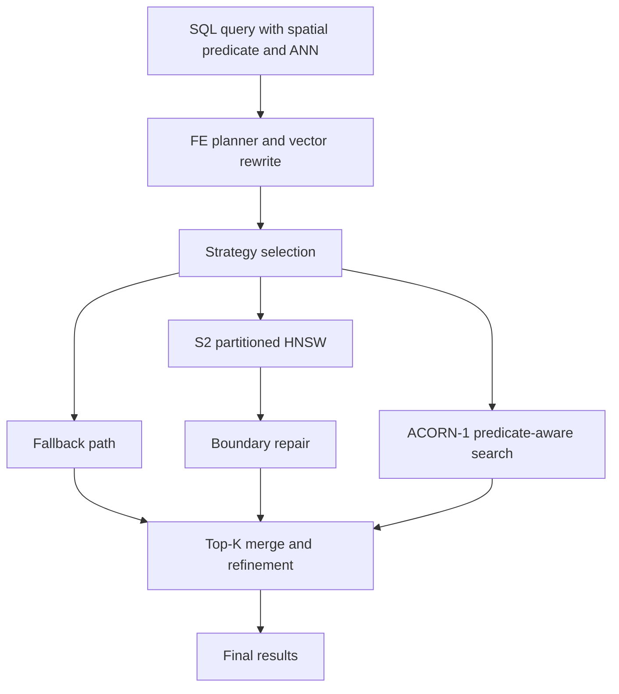

# Master Plan

## Objective

Implement **hybrid spatial+vector search** in StarRocks via multiple approaches -- S2 spatial-partitioned HNSW, ACORN-1 predicate-aware search, and planner fallback -- while preserving clean ablations for:

- partitioning (S2-HNSW)
- predicate-aware graph traversal (ACORN-1)
- planner selection/fallback
- optional boundary repair and correlation-aware tuning

## Architecture Target

## Program Constraints

- The package must fit StarRocks' immutable segment model.
- Planner integration must be explicit and testable.
- Boundary repair must be benchmarkable separately from partitioning.
- SQL integration, FE unit tests, BE unit tests, and microbenchmarks must all be covered.
- The program must leave room for later iteration under this directory without restructuring.

## Concrete StarRocks Hooks

### FE

- `[fe/fe-core/src/main/java/com/starrocks/sql/optimizer/rule/transformation/RewriteToVectorPlanRule.java](fe/fe-core/src/main/java/com/starrocks/sql/optimizer/rule/transformation/RewriteToVectorPlanRule.java)`
- `[fe/fe-core/src/main/java/com/starrocks/common/VectorSearchOptions.java](fe/fe-core/src/main/java/com/starrocks/common/VectorSearchOptions.java)`
- `[fe/fe-core/src/main/java/com/starrocks/planner/OlapScanNode.java](fe/fe-core/src/main/java/com/starrocks/planner/OlapScanNode.java)`
- `[gensrc/thrift/PlanNodes.thrift](gensrc/thrift/PlanNodes.thrift)`

### BE

- `[be/src/storage/rowset/segment_writer.cpp](be/src/storage/rowset/segment_writer.cpp)`
- `[be/src/storage/rowset/array_column_writer.cpp](be/src/storage/rowset/array_column_writer.cpp)`
- `[be/src/storage/rowset/segment_iterator.cpp](be/src/storage/rowset/segment_iterator.cpp)`
- `[be/src/storage/index/vector/vector_index_writer.cpp](be/src/storage/index/vector/vector_index_writer.cpp)`
- `[be/src/storage/index/vector/tenann_index_reader.cpp](be/src/storage/index/vector/tenann_index_reader.cpp)`
- `[be/src/geo/geo_types.h](be/src/geo/geo_types.h)`
- `[be/src/exprs/geo_functions.cpp](be/src/exprs/geo_functions.cpp)`

### Tests and Benchmarks

- `[be/test/storage/index/vector_index_test.cpp](be/test/storage/index/vector_index_test.cpp)`
- `[be/test/storage/index/vector_search_test.cpp](be/test/storage/index/vector_search_test.cpp)`
- `[fe/fe-core/src/test/java/com/starrocks/planner/VectorIndexTest.java](fe/fe-core/src/test/java/com/starrocks/planner/VectorIndexTest.java)`
- `[fe/fe-core/src/test/java/com/starrocks/analysis/VectorIndexTest.java](fe/fe-core/src/test/java/com/starrocks/analysis/VectorIndexTest.java)`
- `[test/sql/test_vector_index/](test/sql/test_vector_index/)`
- `[be/src/bench/](be/src/bench/)`

## Phase Sequence

### Phase 1: Foundation and Ablation Harness (COMPLETE)

Deliverables:

- execution workspace finalized
- ablation matrix locked
- success metrics and benchmark axes defined
- exact code-touch map prepared

### Phase 2: Baseline Fallback (COMPLETE)

Deliverables:

- FE recognition of spatial+vector query pattern
- runtime propagation of fallback mode
- benchmarkable baseline using current StarRocks primitives

### Phase 3: Partitioned Index MVP (COMPLETE)

Deliverables:

- index metadata and file format design
- segment-local S2 partitioning
- per-partition HNSW build/read path
- global merge across matching partitions

### Phase A1-A6: ACORN-1 Implementation (ACTIVE PRIORITY)

ACORN-1 is a predicate-aware HNSW search algorithm that modifies search only (construction is identical to standard HNSW). During search, it uses 2-hop neighbor expansion and predicate filtering to navigate the graph through predicate-satisfying subgraph paths.

- **Phase A1**: ACORN index type and metadata -- FE enum, DDL, BE routing
- **Phase A2**: HNSW graph accessor -- read Faiss HNSW graph from .vi files
- **Phase A3**: Predicate evaluation infrastructure -- spatial radius/polygon evaluators
- **Phase A4**: ACORN-1 search algorithm -- Algorithm 2 implementation + SegmentIterator integration
- **Phase A5**: Query planner integration -- auto-detect ACORN + spatial predicate pushdown
- **Phase A6**: Benchmarking -- full comparison B0/B2/S2-HNSW/ACORN-1

### Phase 4: Boundary Repair (DEFERRED)

Deliverables:

- first boundary repair mechanism, recommended: cross-partition stitching
- isolated toggles for repair on/off
- benchmark cases focused on cell-border recall loss

### Phase 5: Planner Adaptation (DEFERRED)

Deliverables:

- selectivity-driven choice among brute-force, fallback, partitioned, repaired-partitioned, and ACORN
- EXPLAIN/debug visibility
- optional hook for future correlation-aware tuning

### Phase 6: Full Package Validation (DEFERRED)

Deliverables:

- FE and BE correctness suites
- SQL end-to-end coverage
- benchmark suite covering baseline, ablation, and scale paths
- compaction and lifecycle validation

## Agile Delivery Rules

- Each phase is a self-contained planning pack.
- Each pack must define sprint scope, stories, tests, benchmarks, risks, and review checklist.
- Later phases may refine earlier assumptions, but they must not invalidate baseline definitions retroactively.
- Correlation-aware tuning is always optional until the non-correlation ablations are stable.

## Benchmark Program Rules

- Always compare to brute-force and current vector behavior.
- Always test both interior-heavy and boundary-heavy queries.
- Always measure recall and not just latency.
- Keep one benchmark contract constant while changing one feature flag at a time.

## Phase Review Checklist

Each phase must close with:

1. Feature toggles clearly identified
2. Unit/integration test plan complete
3. Benchmark cases in scope documented
4. Risks promoted to `RISKS_AND_ASSUMPTIONS.md` if still open
5. Next phase dependencies explicitly listed
