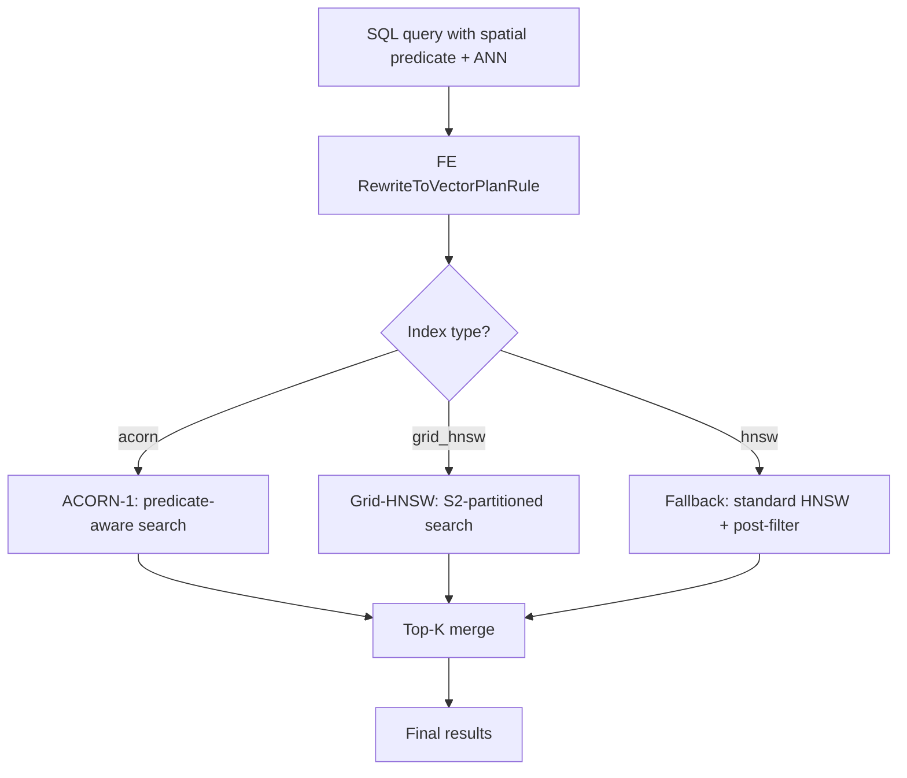

# Master Plan

## Objective

Implement **hybrid spatial+vector search** in StarRocks via two index types -- **ACORN-1** (predicate-aware HNSW traversal) and **Grid-HNSW** (S2-partitioned HNSW) -- with a planner fallback path and a benchmark suite for comparison.

## Architecture

## Concrete StarRocks Hooks

### FE (Java)

- `RewriteToVectorPlanRule.java` — detects spatial+vector pattern, sets `useAcorn` / `useGridHnsw` / `fallbackMode`
- `VectorSearchOptions.java` — carries index type, predicate params, ef_search to BE via Thrift
- `VectorIndexParams.java` — validates `acorn` / `grid_hnsw` index type in DDL

### BE (C++)

- `segment_iterator.cpp` — dispatches to `AcornIndexReader` / `SpatialVectorIndexReader` / standard path
- `acorn_index_reader.{h,cpp}` — ACORN-1 search with 2-hop expansion and predicate filtering
- `hnsw_graph_accessor.{h,cpp}` — custom Faiss binary parser for HNSW graph extraction
- `search_predicate_evaluator.{h,cpp}` — spatial radius/polygon evaluation during search
- `spatial_vector_index_reader.{h,cpp}` — Grid-HNSW per-partition search and merge

### Benchmarks

- `benchmarks/run_full_benchmark.sh` — B0 vs ACORN-1 vs Grid-HNSW
- `benchmarks/run_benchmark.py` — per-mode runner with data gen, load, query, recall

## Delivery Status

### Shipped

| Track | Description | Status |
|-------|-------------|--------|
| **Planner fallback** | FE detects spatial+vector, BE post-filters standard HNSW results | Shipped |
| **Grid-HNSW index** | S2 partitioning, per-cell HNSW, FE cell covering, BE partition search | Shipped |
| **ACORN-1 index** | Predicate-aware HNSW traversal, Faiss binary parser, spatial evaluators | Shipped |
| **FE planner routing** | Auto-detect index type, set `useAcorn`/`useGridHnsw`, predicate pushdown | Shipped |
| **Benchmark suite** | B0/ACORN/Grid comparison, HTML reports, `--skip-baseline`/`--only` flags | Shipped |

### Deferred

| Track | Description | Why Deferred |
|-------|-------------|-------------|
| **Boundary repair** | Cross-partition stitching for Grid-HNSW border vectors | Recall is acceptable without it |
| **Cost model** | Auto-select ACORN vs Grid-HNSW based on selectivity and rho | Requires correlation estimation infrastructure |
| **Cosine/IP metrics** | Only `l2_distance` supported for spatial modes | Faiss parser needs extension |
| **Compaction validation** | Full lifecycle testing under concurrent compaction | Needs sustained load testing |

## Benchmark Program Rules

- Always compare to brute-force ground truth (B0).
- Always measure recall, not just latency.
- Always test multiple selectivities (1km, 5km, 20km radius; small/large polygon).
- Keep one benchmark contract constant while changing one feature flag at a time.

## Reference

See [PRODUCTION_GUIDE.md](PRODUCTION_GUIDE.md) for the complete operational guide.
